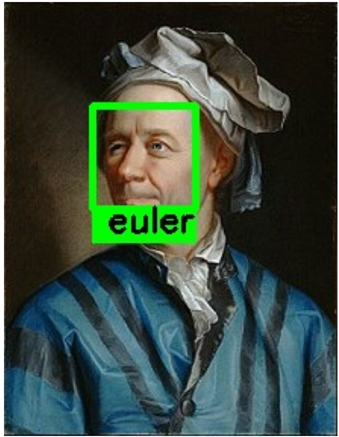

# Facial-Recognition
A system where you can upload identities (faces), and then use a CNN model for finding the face of that person in any picture. In this example I uploaded my github profile pic to the system, and then gave the model this picture:

And here's my favorite mathematician :) :) :


### How to run
```
git clone https://github.com/dilawarm/Facial-Recognition.git
cd Facial-Recognition
pip install -r requirements.txt
cd face_rec && python manage.py runserver
cd face_rec_frontend && npm start
```
